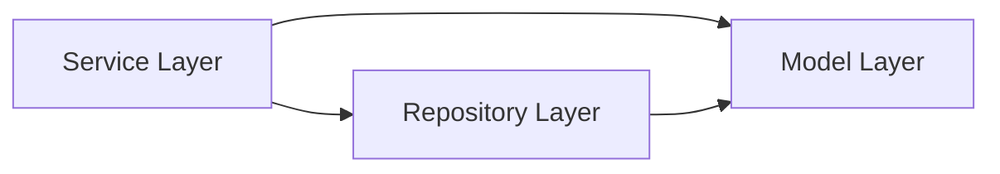

# Karbon-Express-O

Karbon-Express-O is a Python domain and service layer for managing a coffee shop product catalog and transactions, including customers, drinks, ingredients, baked goods, and purchases.

The codebase is organized with a layered architecture:

- Models: domain entities and core invariants
- Repositories: in-memory data access and CRUD
- Services: business rules, validation, and workflow logic

## Table of Contents

- Overview
- Architecture
- Domain Model
- Project Structure
- Getting Started
- Testing
- Current Quality Status
- Limitations and Known Gaps
- Contributors

## Overview

This repository provides the core backend logic for:

- Managing catalog items (drinks, ingredients, baked goods)
- Managing customer records and profile uniqueness constraints
- Recording purchases and aggregate spend
- Enforcing service-level business validation (for example, duplicate prevention and email format validation)

All storage is currently in-memory and optimized for local development and automated testing.

## Architecture

The project follows a classic three-layer application model:

1. Models define entity state and model-level constraints.
2. Repositories provide persistence-like CRUD interfaces over in-memory collections.
3. Services coordinate domain operations, validate rules, and raise domain-specific exceptions.



## Domain Model

### Customer

- Identity and profile fields: `id`, `name`, `email`, `phone`, `username`
- Commercial fields: `lifetime_spend`, `purchases`
- Email validated at service level

### Drink

- Pricing fields: `cost_to_produce`, `markup_percentage`, `sale_price`
- `sale_price` derived in `__post_init__`
- Availability tracking via `is_available`

### Ingredient

- Cost and unit semantics: `purchasing_cost`, `unit_amount`, `unit_of_measure`
- Guardrails for non-negative cost and positive quantity

### BakedGood

- Vendor-scoped identity via `(name, vendor_name)` pairing
- Derived `sale_price` from purchasing cost and markup
- Allergen and availability support

### Purchase

- Links a customer with purchased items and `total_cost`
- Captures purchase timestamp

## Project Structure

```text
models/         Domain entities
repositories/   In-memory data access
services/       Business logic and validation
tests/          Unit tests across all layers
exceptions.py   Shared exception types
```

## Getting Started

### Prerequisites

- Python 3.10+
- `pip`

### Installation

```bash
python -m venv .venv
source .venv/bin/activate  # Linux/macOS
# .venv\Scripts\Activate.ps1  # Windows PowerShell
pip install -U pip pytest
```

### Running Tests

From the repository root:

```bash
PYTHONPATH=. pytest -q
```

Windows PowerShell:

```powershell
$env:PYTHONPATH='.'; pytest -q
```

## Testing

The repository includes broad unit test coverage for:

- Model construction, type conversion, and validation behavior
- Repository CRUD behavior
- Service-level business rules and exception paths

Run targeted suites as needed:

```bash
pytest -q tests/test_model_customer.py
pytest -q tests/test_repository_drink.py
pytest -q tests/test_service_customer.py
pytest -q tests/test_service_drink.py
pytest -q tests/test_service_ingredient.py
pytest -q tests/test_drink_service.py
pytest -q tests/test_service_purchase.py
```

Latest adapted service-suite verification in this workspace:

- Command: `PYTHONPATH=. pytest -q tests/test_service_customer.py tests/test_service_drink.py tests/test_service_ingredient.py tests/test_drink_service.py tests/test_service_purchase.py`
- Result: `26 passed`

## Current Quality Status

Latest service-focused run in this workspace:

- Result: `26 passed`
- Command: `PYTHONPATH=. pytest -q tests/test_service_customer.py tests/test_service_drink.py tests/test_service_ingredient.py tests/test_drink_service.py tests/test_service_purchase.py`

Latest full-suite run in this workspace:

- Result: `162 passed`
- Command: `PYTHONPATH=. pytest -q`

Current suite status is green with no failing tests.

## Limitations and Known Gaps

- In-memory repositories are not durable; data is lost between process runs.
- Service constructor and method signatures are not fully consistent across all domains.

## Contributors

<table>
	<tr>
		<td align="center">
			<a href="https://github.com/wshepelak-catalyte">
				
				<br />
				<sub><b>wshepelak-catalyte</b></sub>
			</a>
		</td>
		<td align="center">
			<a href="https://github.com/asabah-dotcom">
				
				<br />
				<sub><b>asabah-dotcom</b></sub>
			</a>
		</td>
		<td align="center">
			<a href="https://github.com/jfaulkner-catalyte">
				
				<br />
				<sub><b>jfaulkner-catalyte</b></sub>
			</a>
		</td>
		<td align="center">
			<a href="https://github.com/dre108">
				
				<br />
				<sub><b>dre108</b></sub>
			</a>
		</td>
	</tr>
</table>